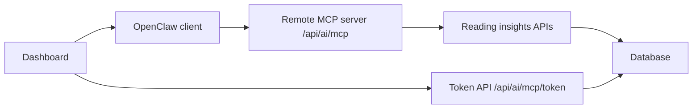

# Remote MCP for Reading Data

## Overview
This branch replaces the earlier local bridge workflow with a site-native, remote MCP server exposed by the Next.js app. OpenClaw now connects directly to the deployed site over Streamable HTTP and authenticates with a read-only Bearer JWT.

## What changed
- Removed the local `mcp:reading` bridge script and its package script entry.
- Kept the site-native MCP endpoint at `/api/ai/mcp`.
- Kept the token management API at `/api/ai/mcp/token`.
- Kept the dashboard UI for issuing, listing, and revoking read-only MCP tokens.

## Architecture


## Request flow
1. A user signs in to the website.
2. The dashboard issues a read-only MCP JWT.
3. OpenClaw connects to `/api/ai/mcp` with `Authorization: Bearer <token>`.
4. The MCP endpoint verifies the token and proxies tool calls to the reading insights layer.
5. The reading insights layer queries the database-backed source of truth.

## MCP endpoint
- Path: `/api/ai/mcp`
- Transport: Streamable HTTP
- Auth: Bearer JWT
- Scope: read-only

### Tools
- `reading.overview`
- `reading.trend`
- `reading.books`
- `reading.notes`
- `reading.plan`

### OpenClaw payload shape
```json
{
  "mcpServers": {
    "knowledge-next-remote": {
      "command": "npx",
      "args": [
        "-y",
        "mcp-remote@latest",
        "https://your-domain.com/api/ai/mcp",
        "--transport",
        "http-only",
        "--header",
        "Authorization: Bearer <mcp_token>"
      ]
    }
  }
}
```

## Token lifecycle
- Tokens are issued from the dashboard only after a normal app session is verified.
- Tokens are stored in MongoDB as digest + preview + metadata.
- Tokens can be listed and revoked from the dashboard.
- `lastUsedAt` is updated whenever a token is successfully used.

## Important implementation files
- `/Users/chao/Documents/coding/knowledge-next/src/app/api/ai/mcp/route.ts`
- `/Users/chao/Documents/coding/knowledge-next/src/app/api/ai/mcp/token/route.ts`
- `/Users/chao/Documents/coding/knowledge-next/src/lib/mcp-token.ts`
- `/Users/chao/Documents/coding/knowledge-next/src/app/api/reading/insights/route.ts`
- `/Users/chao/Documents/coding/knowledge-next/src/components/dashboard/board.tsx`

## Removed legacy bridge code
- `scripts/openclaw-reading-mcp.mjs`
- `package.json` script entry `mcp:reading`

## Review notes
- The remote MCP endpoint does not expose write tools.
- The dashboard-generated token is intended for OpenClaw use only.
- The site can be deployed on Vercel without any local bridge process.
