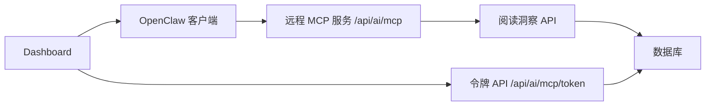

# 阅读数据远程 MCP 方案

## 概述

该分支将早期“本地桥接”流程替换为由 Next.js 应用直接暴露的站点原生远程 MCP 服务。OpenClaw 现在通过 Streamable HTTP 直连已部署站点，并使用只读 Bearer JWT 完成鉴权。

## 变更内容

- 移除了本地 `mcp:reading` 桥接脚本及其 package script 配置。
- 保留了站点原生 MCP 端点 `/api/ai/mcp`。
- 保留了令牌管理 API `/api/ai/mcp/token`。
- 保留了用于签发、查看、吊销只读 MCP 令牌的 Dashboard 界面。

## 架构



## 请求流程

1. 用户登录网站。
2. Dashboard 签发只读 MCP JWT。
3. OpenClaw 通过 `Authorization: Bearer <token>` 连接 `/api/ai/mcp`。
4. MCP 端点校验令牌后，将工具调用代理到阅读洞察层。
5. 阅读洞察层查询以数据库为后端的事实数据源。

## MCP 端点

- 路径：`/api/ai/mcp`
- 传输：Streamable HTTP
- 鉴权：Bearer JWT
- 权限范围：只读

### 工具列表

- `reading.overview`
- `reading.trend`
- `reading.books`
- `reading.notes`
- `reading.plan`

### OpenClaw 配置载荷示例

```json
{
  "mcpServers": {
    "knowledge-next-remote": {
      "command": "npx",
      "args": [
        "-y",
        "mcp-remote@latest",
        "https://your-domain.com/api/ai/mcp",
        "--transport",
        "http-only",
        "--header",
        "Authorization: Bearer <mcp_token>"
      ]
    }
  }
}
```

## 令牌生命周期

- 仅在常规应用会话通过验证后，才可在 Dashboard 中签发令牌。
- 令牌以 digest + preview + metadata 的形式存储在 MongoDB 中。
- 令牌可在 Dashboard 中查看并吊销。
- 每当令牌被成功使用时，都会更新 `lastUsedAt`。

## 关键实现文件

- `/Users/chao/Documents/coding/knowledge-next/src/app/api/ai/mcp/route.ts`
- `/Users/chao/Documents/coding/knowledge-next/src/app/api/ai/mcp/token/route.ts`
- `/Users/chao/Documents/coding/knowledge-next/src/lib/mcp-token.ts`
- `/Users/chao/Documents/coding/knowledge-next/src/app/api/reading/insights/route.ts`
- `/Users/chao/Documents/coding/knowledge-next/src/components/dashboard/board.tsx`

## 已移除的遗留桥接代码

- `scripts/openclaw-reading-mcp.mjs`
- `package.json` 中的 `mcp:reading` 脚本项

## 评审备注

- 远程 MCP 端点不暴露写入类工具。
- Dashboard 生成的令牌仅用于 OpenClaw。
- 站点可直接部署到 Vercel，无需任何本地桥接进程。
