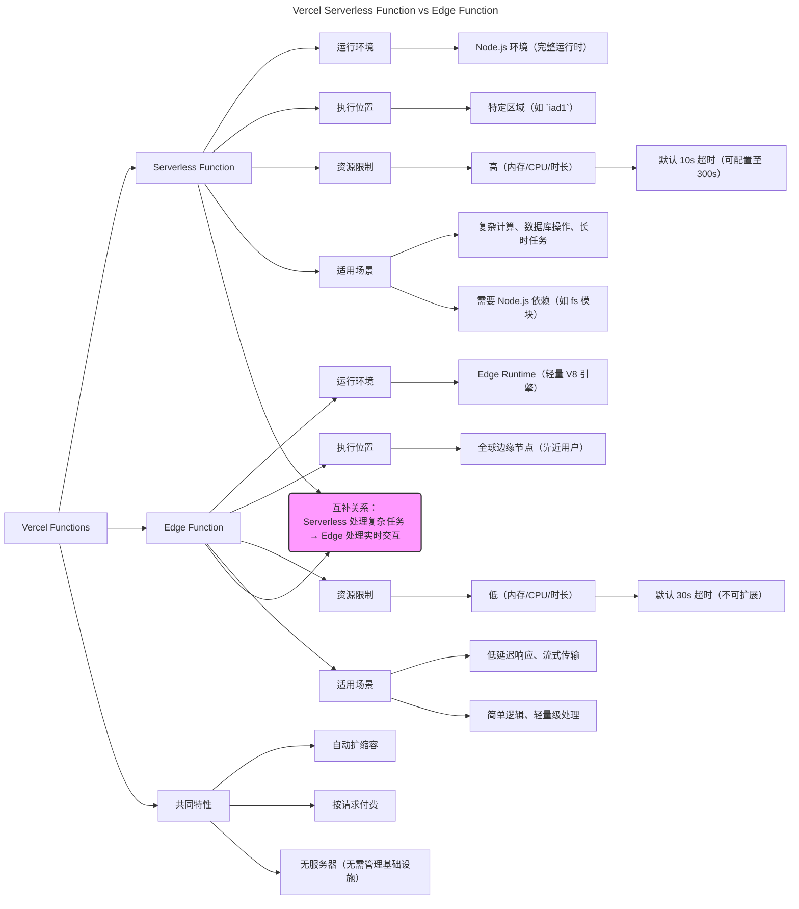

# Vercel related

## Different between edge function and serverless function

```mermaid
---
title: Vercel Serverless Function vs Edge Function
---
graph LR
    A[Vercel Functions] --> B[Serverless Function]
    A --> C[Edge Function]
    
    %% Serverless Function 分支
    B --> D[运行环境]
    D --> D1["Node.js 环境（完整运行时）"]
    B --> E[执行位置]
    E --> E1["特定区域（如 `iad1`）"]
    B --> F[资源限制]
    F --> F1["高（内存/CPU/时长）"]
    F1 --> F1a["默认 10s 超时（可配置至 300s）"]
    B --> G[适用场景]
    G --> G1["复杂计算、数据库操作、长时任务"]
    G --> G2["需要 Node.js 依赖（如 fs 模块）"]
    
    %% Edge Function 分支
    C --> H[运行环境]
    H --> H1["Edge Runtime（轻量 V8 引擎）"]
    C --> I[执行位置]
    I --> I1["全球边缘节点（靠近用户）"]
    C --> J[资源限制]
    J --> J1["低（内存/CPU/时长）"]
    J1 --> J1a["默认 30s 超时（不可扩展）"]
    C --> K[适用场景]
    K --> K1["低延迟响应、流式传输"]
    K --> K2["简单逻辑、轻量级处理"]
    
    %% 共同点
    A --> L[共同特性]
    L --> L1["自动扩缩容"]
    L --> L2["按请求付费"]
    L --> L3["无服务器（无需管理基础设施）"]
    
    %% 联系与对比
    B --> M("互补关系：<br/>Serverless 处理复杂任务 → Edge 处理实时交互")
    C --> M
    style M fill:#f9f,stroke:#333,stroke-width:2px
```